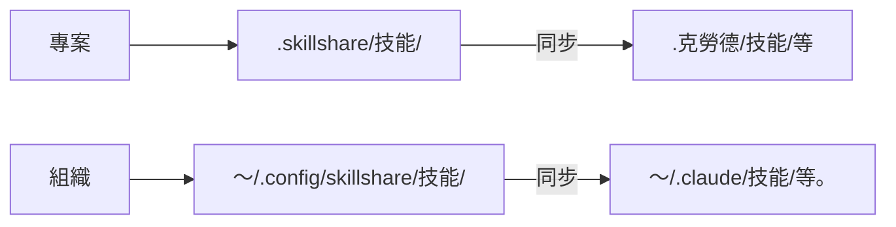

# Introduction

> Source: https://skillshare.runkids.cc/docs/

---

＃ 介紹


**skillshare** 是一個 CLI 工具，可將 AI CLI 技能從單一來源同步到所有 AI 編碼助理。


## 為什麼要分享技能？號


安裝工具讓代理商獲得技能。 **技能共享使他們保持同步。 **


| |一次性安裝工具 |技能分享 |
| --- | --- | --- |
|安裝後 |手動運行更新命令 |合併同步 - 每個技能符號鏈接，保留本地技能 |
|更新技能 |執行更新命令/重新運行安裝|編輯原始程式碼，更改立即反映 |
|撤回編輯 | — |雙向 — 從任何代理處收集 |
| 跨機 |在每台機器上重新運行安裝 | git push/pull — 一個命令同步 |
|本地+已安裝|單獨管理|統一在單一來源目錄中 |
|組織分享|提交 Skills.json 或重新安裝 |追蹤儲存庫 — git pull 更新 |
|專案技巧|每個儲存庫複製技能，隨著時間的推移而出現差異 |專案模式—自動偵測，透過 git 共享 |
|安全稽核|無 |內建 — 安裝時自動掃描、審核指令 |
|人工智慧整合 |僅手動 CLI |內建技能－AI直接操作|


## 快速入門


```
# Install
curl -fsSL https://raw.githubusercontent.com/runkids/skillshare/main/install.sh | sh
# Initialize (auto-detects CLIs, sets up git)
skillshare init
# Install a skill
skillshare install anthropics/skills/skills/pdf
# Sync to all targets
skillshare sync
```


完畢。您的技能現在已在所有 AI CLI 工具之間同步。

不安裝試試

想先探索一下嗎？使用 [Docker Playground](https://skillshare.runkids.cc/docs/how-to/advanced/docker-sandbox#playground) — 一條指令，無需本機安裝：

```
git clone https://github.com/runkids/skillshare.git && cd skillshare
make playground
```


## 工作原理





在來源中編輯→所有目標更新。在目標中編輯 → 變更前往來源（透過符號連結）。


## 主要特點


- **自動偵測** — `cd` 進入具有 `.skillshare/` 的項目，並且技能共享自動切換到項目模式
- **雙層架構** - 公司標準的組織技能 + 回購情境的專案技能
- **即時更新** — 基於符號連結的同步表示編輯內容會立即反映在所有 AI 工具中
- **團隊就緒** - 透過追蹤儲存庫的組織技能，透過 git commit 的專案技能
- **任何 Git 主機** — 從 GitHub、GitLab、Bitbucket、Azure DevOps、AtomGit、Gitee 或任何自架 Git 安裝、更新和檢查
- **安全審核** — 掃描技能以發現提示注入、資料外洩和威脅。安裝時自動掃描


## 支援的平台


|平台|來源路徑|連結類型|
| --- | --- | --- |
| macOS/Linux | 〜/.config/skillshare/skills/|符號連結 |
|窗戶| %AppData%\skillshare\skills\ | NTFS 結點 |


## 後續步驟


### 個人開發者


1. [首次同步](https://skillshare.runkids.cc/docs/getting-started/first-sync) — 5 分鐘內同步
2.【創造技能】(https://skillshare.runkids.cc/docs/how-to/daily-tasks/creating-skills)－寫下你的第一個技能
3.【跨機同步】(https://skillshare.runkids.cc/docs/how-to/sharing/cross-machine-sync) — 保持技能跨機同步


### 團隊領導/組織


1. [組織範圍的技能](https://skillshare.runkids.cc/docs/how-to/sharing/organization-sharing) — 在整個團隊中共享標準
2. [專案設定](https://skillshare.runkids.cc/docs/how-to/sharing/project-setup) — 設定專案範圍的技能
3.【安全審計】(https://skillshare.runkids.cc/docs/reference/commands/audit) — 部署前掃描第三方技能


### 已經擁有技能？號


- [來自現有技能](https://skillshare.runkids.cc/docs/getting-started/from-existing-skills) — 遷移與整合


### 探索更多


- [核心概念](https://skillshare.runkids.cc/docs/understand) — 來源、目標、同步模式
- [指令參考](https://skillshare.runkids.cc/docs/reference/commands) — 所有可用指令
- [Docker Sandbox](https://skillshare.runkids.cc/docs/how-to/advanced/docker-sandbox) — 在隔離環境中嘗試技能共享
- [常見問題](https://skillshare.runkids.cc/docs/troubleshooting/faq) — 常見問題