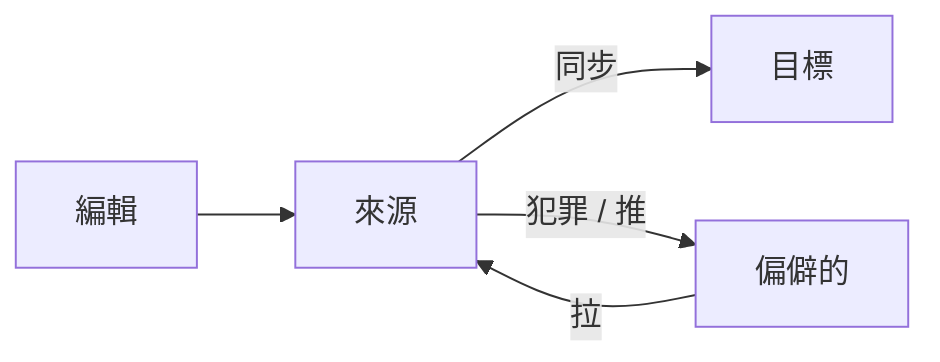

# Daily Workflow

> Source: https://skillshare.runkids.cc/docs/how-to/daily-tasks/daily-workflow

---

# 日常工作流程

用於日常技能管理的編輯→同步→提交/推/拉循環。

## 概述



---

## 編輯技巧

### 選項 1：在原始程式碼中編輯（建議）

```
$EDITOR ~/.config/skillshare/skills/my-skill/SKILL.md
```

變更在所有目標中立即可見（透過符號連結）。

### 選項 2：在目標中編輯

```
$EDITOR ~/.claude/skills/my-skill/SKILL.md
```

因為目標是符號連結的，所以這會直接編輯原始檔。

---

## 同步

編輯後，由於符號鏈接，**通常不需要**。但是，請在以下情況下運行同步：

*   您已安裝或移除技能
*   您已變更同步模式
*   您已新增或刪除目標
*   您在狀態中看到“不同步”

```
skillshare sync
```

為什麼同步是一個單獨的步驟？

同步有意與安裝/更新/卸載分離。這使您可以批量進行多個更改（例如，安裝 3 個技能 → 同步一次），在傳播之前使用 `--dry-run` 進行預覽，並完全控制目標更新的時間。有關詳細信息，請參閱[來源和目標：為什麼同步是一個單獨的步驟](https://skillshare.runkids.cc/docs/understand/source-and-targets#why-sync-is-a-separate-step)。

### 先預覽

```
skillshare sync --dry-run
```

### 僅同步代理

如果您僅變更代理程式（或只想將代理程式推送到支援代理程式的目標），請確定同步範圍：

```
skillshare sync agents
```

`skillshare sync` 一鍵運作技能和特工。有關代理文件格式和支援的目標，請參閱[代理](https://skillshare.runkids.cc/docs/understand/agents)。

---

## Git 檢查點和跨機同步

### 本地提交

當您想要本地還原點而不推送到遠端時，請使用`commit`：

```
skillshare commit -m "Update draft skill"
```

這運行：

1.`git add .`  
2.`git commit -m "Update draft skill"`

即使來源儲存庫沒有配置遠端，`commit` 也可以工作。

### 推送變更（從本機）

如果您使用 git 遠程，`push` 透過一個命令提交並共用變更：

```
skillshare push -m "Add new skill"
```

這運行：

1.`git add .`  
2.`git commit -m "Add new skill"`  
3.`git push`

### 拉取更改（到這台機器）

```
skillshare pull
```

這運行：

1.`git pull`  
2.`skillshare sync`

---

## 常見日常任務

### 建立新技能

```
skillshare new code-review
$EDITOR ~/.config/skillshare/skills/code-review/SKILL.md
skillshare sync
```

### 編輯或新增代理

代理是`~/.config/skillshare/agents/`中的單一`.md`檔。直接使用編輯器建立或編輯它們：

```
$EDITOR ~/.config/skillshare/agents/reviewer.md
skillshare sync agents
```

`disable` / `enable` 透過 `.agentignore` 切換各個代理程式而不刪除它們：

```
skillshare disable reviewer --kind agent     # Excludes from sync
skillshare enable reviewer --kind agent      # Re-enables
```

### 更新追蹤的倉庫

```
skillshare update _team-skills
skillshare sync
```

### 更新所有追蹤的儲存庫

```
skillshare update --all
skillshare sync
```

### 檢查狀態

```
skillshare status
```

顯示：

*   來源目錄狀態
*   Git 狀態（提前/落後提交）
*   目標同步狀態

---

## 提示

### 讓它自動

新增到您的 shell 啟動中：

```
# ~/.bashrc or ~/.zshrc
alias ss="skillshare"
alias sss="skillshare sync"
alias ssc="skillshare commit"
alias ssp="skillshare push"
alias ssl="skillshare pull"
```

###重要工作前檢查

```
# Start of day
skillshare pull
skillshare status
# Before committing
skillshare diff
```

### 保持物品清潔

```
# Weekly maintenance
skillshare audit             # Scan for security threats
skillshare backup --cleanup  # Remove old backups
skillshare doctor            # Check for issues
```

---

## 另請參閱

*   [sync](https://skillshare.runkids.cc/docs/reference/commands/sync) — 核心同步指令
*   [狀態](https://skillshare.runkids.cc/docs/reference/commands/status) — 檢查同步狀態
*   [commit](https://skillshare.runkids.cc/docs/reference/commands/commit) — 本地 git 檢查點，無需推送
*   [推](https://skillshare.runkids.cc/docs/reference/commands/push) / [拉](https://skillshare.runkids.cc/docs/reference/commands/pull) — 跨機同步
*   [技能發現](https://skillshare.runkids.cc/docs/how-to/daily-tasks/skill-discovery) — 發現新技能