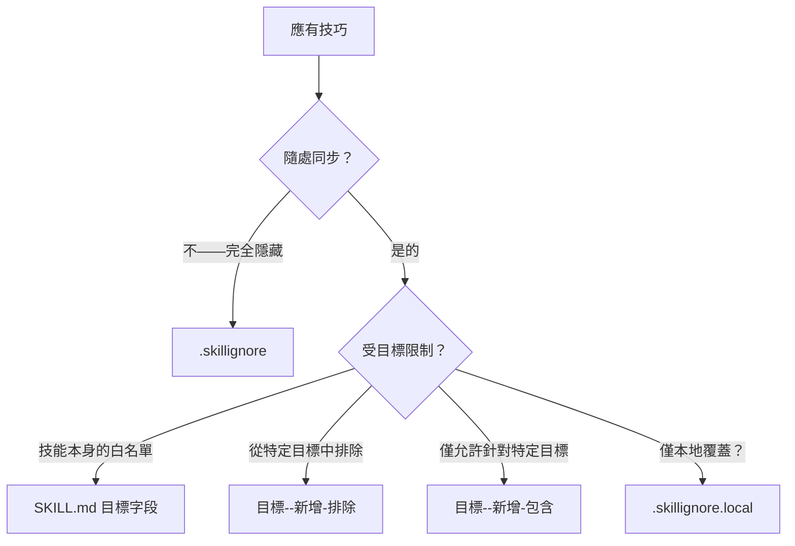

# Filtering Skills

> Source: https://skillshare.runkids.cc/docs/how-to/daily-tasks/filtering-skills

---

# 濾鏡技巧


Skillshare 提供三個過濾層，控制哪些技能達到哪些目標。選擇符合您目標的場景。


## 僅將技能同步到特定目標


將 `metadata.targets` （首選）加入技能的 SKILL.md frontmatter 中。此技能只會同步到列出的目標。


```
---name: my-cursor-only-skillmetadata:  targets: [cursor]---
```


支援目標別名 - `claude` 匹配 `claude` 和 `claude-code`。


📖 [SKILL.md 目標欄位](https://skillshare.runkids.cc/docs/understand/skill-format#targets) · [過濾參考](https://skillshare.runkids.cc/docs/reference/filtering#skillmd-targets-field)


## 從一個目標排除特定技能


在目標上使用`--add-exclude`來阻止與全域模式匹配的技能：


```
skillshare target cursor --add-exclude "legacy-*"
skillshare sync
```


📖 [目標過濾標誌](https://skillshare.runkids.cc/docs/reference/commands/target#target-filters-includeexclude) · [過濾參考](https://skillshare.runkids.cc/docs/reference/filtering#target-includeexclude-filters)


## 只允許針對一個目標使用特定技能


使用`--add-include`創建白名單－只有匹配的技能才會同步：


```
skillshare target claude --add-include "team-*"
skillshare sync
```


📖 [目標過濾標誌](https://skillshare.runkids.cc/docs/reference/commands/target#target-filters-includeexclude) · [過濾參考](https://skillshare.runkids.cc/docs/reference/filtering#target-includeexclude-filters)


## 對所有目標隱藏技能


將 `.skillignore` 檔案放入來源目錄中。與這些模式相符的技能在發現時被排除在**所有**目標之外：

〜/.config/skillshare/skills/.skillignore

```
drafts/experimental-*
```


新增或刪除模式的最快方法是使用 `enable` / `disable` 指令：


```
skillshare disable experimental-*   # adds to .skillignore
skillshare enable experimental-*    # removes from .skillignore
```


您也可以在 `skillshare list` TUI 中按 **E** 開啟或關閉技能。


📖 [啟用/禁用](https://skillshare.runkids.cc/docs/reference/commands/enable) · [.skillignore 語法](https://skillshare.runkids.cc/docs/reference/appendix/file-structure#skillignore-optional) · [過濾參考](https://skillshare.runkids.cc/docs/reference/filtering#skillignore)


## 排除追蹤倉庫中的技能


將 `.skillignore` 放入追蹤的儲存庫目錄中。它只影響該儲存庫中的技能：

_team-repo/.skillignore

```
internal-only/*validation-scripts
```


📖 [回購等級.skillignore](https://skillshare.runkids.cc/docs/reference/appendix/file-structure#skillignore-optional)


## 僅限本地覆蓋


`.skillignore.local` 附加在 `.skillignore` 之後 — 最後匹配的規則獲勝。使用否定模式在本機取消忽略技能，而無需編輯共用檔案：

_team-repo/.skillignore.local

```
# The repo ignores private-*, but I need mine!private-mine
```


不要提交此文件 - 將其添加到 `.gitignore`。


📖 [.skillignore.local](https://skillshare.runkids.cc/docs/reference/appendix/file-structure#skillignorelocal-optional)


## 我該使用哪一層？號





## 如何驗證正在過濾的內容


|命令| What it shows |
| ---| ---|
| skillshare sync |忽略底部的技能計數和名稱 |
|技能分享狀態--json | Full .skillignore stats (patterns, ignored skills, active files) |
| skillshare doctor | Health check includes .skillignore pattern count and ignored count |
| Skillshare ui → 同步頁面 | Collapsible "Ignored by .skillignore" card with badge |


## 另請參閱


- [過濾參考](https://skillshare.runkids.cc/docs/reference/filtering) — 所有三層的完整規範
- [同步指令](https://skillshare.runkids.cc/docs/reference/commands/sync#per-target-includeexclude-filters) — 過濾器行為範例
- [目標指令](https://skillshare.runkids.cc/docs/reference/commands/target#target-filters-includeexclude) — 用於包含/排除的 CLI 標誌