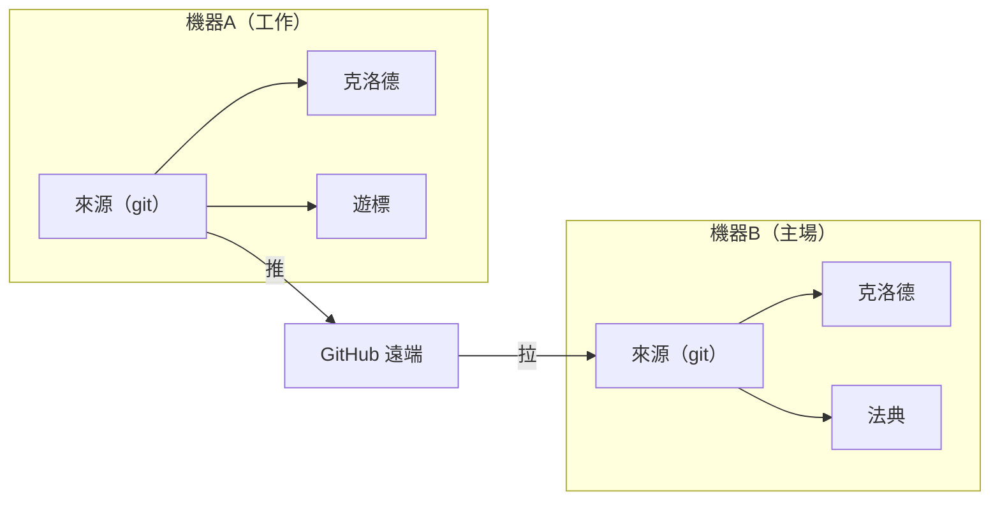

# Cross-Machine Sync

> Source: https://skillshare.runkids.cc/docs/how-to/sharing/cross-machine-sync

---

# 跨機同步


使用 git 在多台電腦上同步您的技能。


## 概述





---


## 第一台機器設定


### 互動（引導提示）


```
skillshare init --remote git@github.com:you/my-skills.git
```


### 非互動式（無提示）


```
# Remote already has your skills (or start fresh source)
skillshare init --remote git@github.com:you/my-skills.git --no-copy --all-targets --no-skill
# First machine with existing Claude skills: import during init
skillshare init --remote git@github.com:you/my-skills.git --copy-from claude --all-targets --no-skill
```


這：


1.建立源碼目錄
2. 使用初始提交初始化 git
3.新增遙控器
4. 自動偵測並配置目標


稍後可選（僅當您在設定後安裝額外的 AI CLI 時）：


```
skillshare init --discover
```


然後提升你的技能：


```
skillshare push
```

已經初始化了嗎？

將遙控器新增至現有設定：

```
skillshare init --remote git@github.com:you/my-skills.git
```

即使在初始設定後，它也能工作——它只是添加了遙控器。


---


## 第二台機器設定


在新機器上，**相同的指令有效**：


```
skillshare init --remote git@github.com:you/my-skills.git
```


Init 會自動偵測遙控器是否具有現有技能並將其拉下來。無需手冊`git clone`。

幕後發生了什麼

1.建立源碼目錄並初始化git
2.新增遙控器並運作`git fetch`
3.偵測到遠端有技能→重置本地以匹配遠程
4. 設定追蹤分支
5. 自動偵測並配置本地目標


如果您喜歡手動控制：


```
# Clone directly, then init with existing source
git clone git@github.com:you/my-skills.git ~/.config/skillshare/skills
skillshare init --source ~/.config/skillshare/skills
skillshare sync
```


---


## 日常工作流程


### 機器 A：進行更改並推送


```
# Edit skills (changes visible immediately via symlinks)
$EDITOR ~/.config/skillshare/skills/my-skill/SKILL.md
# Optional: create a local checkpoint without pushing
skillshare commit -m "Update my-skill"
# Push to remote when ready to share
skillshare push -m "Update my-skill"
```


### 機器 B：拉取並同步


```
skillshare pull
```


就是這樣。拉动后`pull`自动运行`sync`。


---


## 命令


### 承諾


建立本地檢查點而不推送：


```
skillshare commit                  # Default message
skillshare commit -m "Add pdf"     # Custom message
skillshare commit --dry-run        # Preview
```


**會發生什麼事：**


```
git add -A
git commit -m "Add pdf"
```


`commit`不需要遙控器，也不會推送。


### 推


提交並推送本地變更：


```
skillshare push                  # Auto-generated message
skillshare push -m "Add pdf"     # Custom message
```


**會發生什麼事：**


```
git add -A
git commit -m "Add pdf"
git push          # auto-sets upstream on first push
```


### 拉動


拉取遠端變更並同步：


```
skillshare pull
```


**會發生什麼事：**


```
git pull           # or fetch + reset on first pull
skillshare sync
```


---


## 衝突處理


### 拉取失敗（本地未提交的變更）


如果您想保留本地更改但尚未準備好推送它們，請先在本地提交它們：


```
skillshare commit -m "Save local changes"
skillshare pull
```


### 推送失敗（遠端前進）


```
$ skillshare push
Push failed  Remote may have newer changes  Run: skillshare pull  Then: skillshare push
```


**解決方案：**


```
skillshare pull
skillshare push
```


### 由於本地未提交的更改，拉取仍然失敗


```
$ skillshare pull
Local changes detected  Run: skillshare push  Or:  cd ~/.config/skillshare/skills && git stash
```


**解決方案：**


```
# Option 1: Commit locally first
skillshare commit -m "Local changes"
skillshare pull
# Option 2: Push your changes first
skillshare push -m "Local changes"
skillshare pull
# Option 3: Stash changes temporarily
cd ~/.config/skillshare/skills
git stash
skillshare pull
git stash pop
```


### 合併衝突


```
cd ~/.config/skillshare/skills
git status                    # See conflicted files
# Edit files to resolve
git add .
git commit -m "Resolve conflicts"
skillshare sync
```


---


## 檢查狀態


```
skillshare status
```


顯示：


- Git 狀態（乾淨、領先、落後）
- 遠端配置
- 同步狀態


---


## 私有儲存庫


使用 SSH URL 進行私有儲存庫：


```
skillshare init --remote git@github.com:you/private-skills.git
```


---


## 提示


### 使用 SSH 金鑰


設定 SSH 金鑰以避免密碼提示：


```
ssh-keygen -t ed25519 -C "your@email.com"
# Add public key to GitHub
```


### 點檔案的可移植路徑


如果您透過點檔案共用`config.yaml`，請啟用`preserve_tilde_on_save`以將路徑保留為`~/...`而不是`/home/alice/...`：


```
preserve_tilde_on_save: true
```


當在具有不同使用者名稱或特定於作業系統的主前綴的電腦上使用相同的配置時，這可以防止雜訊差異。請參閱[配置-preserve_tilde_on_save](https://skillshare.runkids.cc/docs/reference/targets/configuration#preserve_tilde_on_save)。


### 多個遙控器


新增備用遙控器：


```
cd ~/.config/skillshare/skills
git remote add backup git@gitlab.com:you/skills-backup.git
git push backup main
```


### 在 shell 啟動時同步


加入`~/.bashrc`或`~/.zshrc`：


```
# Sync skillshare on terminal open (if remote configured)
skillshare pull 2>/dev/null
```


---


## 替代方案：從設定安裝


如果您不想設定 git 遠程，`config.yaml` 也可以用作便攜式技能清單。每個 `install` / `uninstall` 自動更新 `skills:` 部分，並且 `skillshare install` （無參數）重新安裝列出的所有內容：


```
# Machine A — config.yaml records what you installed
skillshare install anthropics/skills -s pdf
# config.yaml now has: skills: [{name: pdf, source: "..."}]
# Machine B — copy config.yaml, then:
skillshare install      # Installs all listed skills
skillshare sync
```


### 何時使用which


| |推/拉|安裝（無參數）|
| ---| ---| ---|
|同步了什麼 |實戰技能檔案（完整內容）|僅限來源 URL — 安裝時重新下載 |
|本地/手寫技能 |包含 |不包含（被動 URL）|
|需要設定 |來源目錄上的 Git 遠端 |只需 config.yaml |
|專案模式|僅限全球|與 -p (.skillshare/config.yaml) 一起使用 |
|保養|更改後手動推播 |安裝/卸載時自動協調 |


**建議**：使用`push`/`pull`進行個人跨機同步。使用配置中的`install`進行團隊入職和專案設定。


---


## 另請參閱


- [push](https://skillshare.runkids.cc/docs/reference/commands/push) — 推送至远程
- [拉](https://skillshare.runkids.cc/docs/reference/commands/pull) — 从远程拉
- [安装](https://skillshare.runkids.cc/docs/reference/commands/install#install-from-config-no-arguments) — 从配置安装
- [組織範圍的技能](https://skillshare.runkids.cc/docs/how-to/sharing/organization-sharing) — 團隊共享
- [init](https://skillshare.runkids.cc/docs/reference/commands/init) — 使用 `--remote` 進行初始化