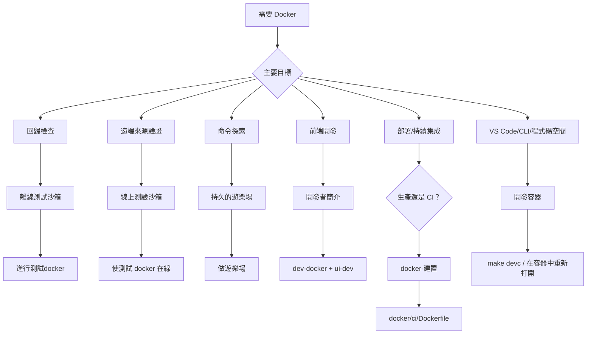

# Docker Test, Develop, and Deploy

> Source: https://skillshare.runkids.cc/docs/how-to/advanced/docker-sandbox

---

# Docker：測試、開發和部署


使用 Docker 進行可重複測試、無需 Go 的前端開發、生產部署以及 CI 中的自動化技能驗證。


## 模式選擇圖





命令映射：


|指令|米塞|使|
| ---| ---| ---|
|測試（離線）| mise運行測試：docker |進行測試-docker |
|測試（線上）| mise 運行測試：docker:online |使測試-docker-在線 |
| Playground（啟動+shell）|米塞跑遊樂場|打造遊樂場|
|遊樂場（站）|米塞跑遊樂場：向下|使遊樂場下降|
|沙盒（進階）| — | ./scripts/sandbox.sh <up\|down\|shell\|重設\|狀態\|日誌\|裸> |
| Devcontainer（啟動+shell）|運行devc |使devc |
| Devcontainer（僅啟動）| mise 運行 devc:up |製作devc-up |
|開發容器（停止）| mise 運行 devc:down |使 devc-down |
|開發容器（重新啟動）| mise 運行 devc:restart |使 devc 重新啟動 |
| Devcontainer（完全重置）| mise 運行 devc:reset |使 devc 重置 |
|開發容器（狀態）| mise 運行 devc:status |使 devc-status |
|開發 API 伺服器 |運行 dev:docker |製作 dev-docker |
|開發停止 |運行 dev:docker:down |使 dev-docker-down |
| Docker 建置 |執行 docker:build |製作 docker-build |
| Docker 多架構 |運行 docker:build:multiarch |使 docker-build-multiarch |


## 你可以用它做什麼


|模式|最適合 |網路|生命週期 |
| ---| ---| ---| ---|
|離線測試沙箱 |穩定的回歸檢查（建置+單元+整合）|已停用 |一擊|
|線上測試沙箱 |可選的遠端安裝/更新檢查 |已啟用 |一擊|
|互動遊樂場|手動命令探索和演示 |已啟用 |堅持不懈|
|開發簡介 |主機上 Docker + Vite HMR 中的 Go API 伺服器 |已啟用 |堅持不懈|
|開發容器 | VS Code/Codespaces 一鍵開發環境 |已啟用 |堅持不懈|
|生產形象 |輕量級部署（docker/生產/） |已啟用 |堅持不懈|
| CI形象 |管道中的技能驗證 (docker/ci/) |已啟用 |一擊|


---


## 常見場景


### 1. 確定性地驗證本機安裝/更新邏輯


當您更改 `install` / `update` 行為並想要類似 CI 的本地門時，請使用此選項。


```
mise run test:docker
make test-docker
```


這會單獨驗證本機路徑和`file://`工作流程。


### 2. 執行可選的遠端來源檢查


將此用於依賴網路存取的 GitHub/遠端來源驗證。


```
make test-docker-online
```


### 3. 開啟專用遊樂場並探索所有指令


啟動並進入遊樂場的一個命令：


```
make playground
mise run playground
```


操場內，`skillshare`和`ss`已經準備好了。全域模式和項目模式都是預先初始化的：


```
skillshare --help
ss status
skillshare list
```


### 遊樂場中的項目模式


Playground 會自動在 `~/demo-project` 設定一個示範項目，其中包含範例技能和 `claude` 目標。您可以立即開始探索專案模式：


```
cd ~/demo-project
skillshare status        # auto-detects project mode
skillshare list
skillshare sync --dry-run
```


若要啟動 Web 儀表板，請使用內建別名：


```
skillshare-ui            # global mode dashboard → http://localhost:19420
skillshare-ui-p          # project mode dashboard (~/demo-project) → http://localhost:19420
```


然後在主機上開啟`http://localhost:19420`（連接埠透過 Docker Compose 映射）。


### GitHub 令牌（用於搜尋）


Playground 會自動從主機取得 `skillshare search` 的 GitHub 令牌。它按順序檢查：`$GITHUB_TOKEN`→`$GH_TOKEN`→`gh auth token`。如果您已經在主機上進行了身份驗證，則無需額外設定。


```
# If not detected, set it before starting the playground:
export GITHUB_TOKEN=ghp_your_token_here
make playground
```


完成後：


```
make playground-down
```


---


## 按角色劃分的用例


### 個人開發者


|場景 |使用什麼 |它取代了什麼 |
| ---| ---| ---|
|嘗試在不安裝 Go/Node 的情況下分享技能 | docker run ghcr.io/runkids/skillshare |安裝 Go + Node + pnpm，然後從原始碼建置 |
|在打開 PR 之前運行完整的測試套件 |進行測試-docker |取決於本地工具鏈（Go 版本不匹配 = 不穩定的結果）|
|無需安裝 Go 的前端工作 |製作 dev-docker + cd ui && pnpm run dev |必須在本地安裝 Go 1.25+ 才能運行 API 伺服器 |
|向同事示範技能分享 |製作遊樂場 → 網頁使用者介面：19420 |引導他們完成完整的本機安裝 |
|驗證 Apple Silicon 上的 Linux 行為 |製作 docker-build |推送到 CI 並等待 |


### 團隊和開源貢獻者


|場景 |使用什麼 |它解決了什麼問題 |
| ---| ---| ---|
|新貢獻者入職 |創建遊樂場——一個命令，準備就緒 |不再需要“安裝 Go、設置 PATH、克隆、構建”設置指南 |
| CI 中的自動化技能品質門 | docker run ghcr.io/.../skillshare-ci 審核 /skills |以前需要在每個工作流程中從原始程式碼安裝 Go + 建置 |
|貢獻者「在我的機器上運行」| Docker 固定 Go 1.25.5 + 所有依賴項 |不同的本地 Go 版本導致測試失敗 |
| PR 審閱者重現問題 | ./scripts/test_docker.sh --cmd "go test -run TestXxx ..." |必須複製 + 完整的本機設定才能重現 |


### 企業和自架部署


|場景 |使用什麼 |價值|
| ---| ---| ---|
|內部技能管理儀表板|製作鏡像+卷宗掛載技能|一個容器，伺服器上沒有 Go/Node |
| Kubernetes 部署 |生產鏡像（健康檢查+正常關閉+非root）|準備就緒/活躍度探測，通過 PodSecurityPolicy |
|自動化技能公關審核 | GitHub Actions 中的 CI 鏡像 + Skillshare 審核 |阻止不安全技能合併－工作流程中的一行 |
|容器安全合規| read_only + cap_drop：全部 + 無新權限 |通過 CIS Docker 基準測試、Trivy 和 Aqua 掃描 |
| ARM 伺服器 (AWS Graviton) 可節省成本 |使 docker-build-multiarch |原生arm64映像，無模擬開銷|


### 簡單範例


**具有持久技能的自架儀表板：**


```
docker run -d \
  -p 19420:19420 \
  -v skillshare-data:/home/skillshare/.config/skillshare \
  ghcr.io/runkids/skillshare
```


**GitHub Actions 中的 CI 技能審核：**


```
- name: Audit skills
  run: |
    docker run --rm \
      -v ${{ github.workspace }}/skills:/skills \
      ghcr.io/runkids/skillshare-ci audit /skills
```


**Kubernetes 部署（最小）：**


```
apiVersion: apps/v1
kind: Deployment
metadata:
  name: skillshare
spec:
  replicas: 1
  template:
    spec:
      containers:
        - name: skillshare
          image: ghcr.io/runkids/skillshare:latest
          ports:
            - containerPort: 19420
          livenessProbe:
            httpGet:
              path: /api/health
              port: 19420
          readinessProbe:
            httpGet:
              path: /api/health
              port: 19420
          securityContext:
            runAsNonRoot: true
            readOnlyRootFilesystem: true
```


---


## 開發者簡介


使用Vite HMR開發前端的兩種方式：


**本地安裝 Go**（單一命令）：


```
make ui-dev              # starts Go API server + Vite dev server together
# Open http://localhost:5173
```


**沒有 Go** （Go API 在 Docker 中運行，在 Go 更改時自動重建）：


```
# Terminal 1
make dev-docker          # Go API in Docker + Compose Watch (localhost:19420)
# Terminal 2
cd ui && pnpm run dev    # Vite dev server (localhost:5173, proxies /api → :19420)
# When done
make dev-docker-down
```


這兩種方法都可以為您提供針對 `ui/` 更改的即時 HMR。 Docker 變體固定了 Go 工具鏈，因此貢獻者之間的後端行為是一致的。當您編輯 Go 檔案時，Compose Watch 會偵測變更、重建容器並自動重新啟動 API 伺服器。需要 Docker Compose v2.22+。


**注意：** Go程式碼變更需要在使用`make ui-dev`時重新啟動伺服器（`Ctrl+C`並重新運行）。 `make dev-docker` 透過 Compose Watch 自動處理此問題。


---


## Devcontainer（VS Code / Codespaces / CLI）


在准备编码的容器中打开项目 - 不需要本地 Go、Node 或 pnpm。使用**或不使用** VS Code 均可使用。

Devcontainer 與 Playground

兩者都使用相同的基礎圖像和演示內容。 **playground** (`make playground`) 是一個用來探索指令的純終端環境。 **devcontainer** 添加了用于开发技能共享代码库本身的开发工具（Go、Node、pnpm、air）——可从 VS Code、Codespaces 或普通终端使用。


### 先決條件


- [Docker 桌面](https://www.docker.com/products/docker-desktop/) 運行
- **選項 A（終端）：** 無需額外工具 — `make devc` 處理一切
- **選項 B（VS Code）：** 安裝了 [Dev Containers](https://marketplace.visualstudio.com/items?itemName=ms-vscode-remote.remote-containers) 擴充的 VS Code

GitHub 程式碼空間

在 GitHub 上，按一下 **程式碼 → 程式碼空間 → 新程式碼空間**。 devcontainer 配置會自動取得 - 無需本機 Docker 或擴充。


### 開始


**從終端機**（不需要 VS Code）：


```
make devc            # build image → start container → setup → enter shell
```


首次運行需要幾分鐘（建置映像、安裝 deps）。後續運行將檢測現有設定並直接跳至 ​​shell。


其他生命週期指令：


```
make devc-up         # start only (no shell)
make devc-down       # stop container
make devc-restart    # restart + re-run start-dev.sh
make devc-reset      # full reset (remove volumes), then make devc to re-init
make devc-status     # show container status
```


**來自 VS 代碼：**


1.在VS Code中開啟專案資料夾
2. 按 `Ctrl+Shift+P`（或 macOS 上的 `Cmd+Shift+P`）並選擇 **開發容器：在容器中重新開啟**
3.等待容器建置（第一次需要幾分鐘，後續開啟很快）
4. 準備好後，安裝腳本將建立二進位檔案並自動建立簡報技能


### 包含什麼


devcontainer 重複使用與沙箱相同的 `docker/sandbox/Dockerfile`，因此你得到：


- Go 1.25 工具鏈
- Node.js 24 + pnpm（捆綁在 Docker 映像中）－在容器內啟用 `make ui-dev` 和 `cd website && pnpm start`
- VS Code 擴充：Go、Tailwind CSS、ESLint、Prettier
- 轉送埠：`19420`（Web UI）、`5173`（Vite HMR）、`3000`（Docusaurus）
- 原始碼安裝在`/workspace`
- **預先配置的演示環境** - 與互動式遊樂場相同：

- PATH 中的快速指令（`ss`、`ui`、`docs`）
- 預先安裝前端相依性（`ui/`和`website/`）
- 全域簡報技能（審核範例、部署清單）
- 自訂審核規則（全域+項目）
- `~/demo-project` 的示範項目，具備項目模式技能


### 容器開啟後快速啟動


```
ss status                 # global mode — already initialized
ss list                   # see demo skills (flat + nested)
ss audit                  # run audit with custom rules
cd ~/demo-project
ss status                 # auto-detects project mode
ss audit                  # project-level audit
ui -p                     # switch API to project mode → http://localhost:5173
```


### 前端開發


|港口|服務 |命令|
| ---| ---| ---|
| 5173 | 5173 Vite（React UI + HMR）| ui 或 ui -p |
| 19420| Go API 後端 |由 ui / ui -p | 開始
| 3000 | 3000多庫龍 |文檔 |


```
ui                        # global mode: API + Vite → http://localhost:5173
ui -p                     # project mode: API + Vite → http://localhost:5173
ui stop                   # stop API + Vite
docs                      # documentation site → http://localhost:3000
docs stop                 # stop Docusaurus
```


`ui` 同時啟動 Go API 後端（連接埠 19420，後台）和 Vite 開發伺服器（連接埠 5173，HMR）。在`ui`和`ui -p`之間切換會自動以新模式重新啟動API。 VS Code 會自動將連接埠轉送至您的主機瀏覽器。


### 代幣配置


用於私有儲存庫存取的代幣（`GITHUB_TOKEN`、`GITLAB_TOKEN`等）可以來自多個來源。它們按以下順序檢查：


|優先|來源 |設定|
| ---| ---| ---|
| 1 | .devcontainer/.env |複製.env.example → .env，填入值（gitignored）|
| 2 |主機環境變數 |在 ~/.zshrc 中設定 — 透過 devcontainer.json 中的 remoteEnv 轉送 |
| 3 | gh 授權登入 |容器啟動時自動偵測 GITHUB_TOKEN（僅限 GitHub）|


所有來源都是可選的。您也可以隨時在容器內手動使用`export`。


檢查當前狀態：


```
credential-helper status
```


### 私人倉庫測試


VS Code Dev Containers 會自動將您的主機 git 憑證轉送到容器中。這意味著即使沒有明確令牌環境變量，私有儲存庫的`git clone`也可能成功——轉發的憑證助理會默默地處理身份驗證。


若要停用**所有**身份驗證（憑證助理+令牌環境變數）以進行測試：


```
eval "$(credential-helper --eval off)"    # disable everything
eval "$(credential-helper --eval on)"     # restore everything
credential-helper status                  # check current state
```


如果沒有 `--eval`，則僅切換 git 憑證助手（令牌環境變數保持活動狀態）。


### 運行測試


```
make test          # unit + integration
make test-unit     # unit only
make lint          # go vet
```


---


## 生產和 CI 圖像


### 影像比較


三個 Dockerfile 有不同的用途：


| |生產| CI |沙盒|
| ---| ---| ---| ---|
|圖片| ghcr.io/runkids/skillshare | ghcr.io/runkids/skillshare | ghcr.io/runkids/skillshare-ci | ghcr.io/runkids/skillshare-ci |僅本地構建 |
| Dockerfile | docker/生產/Dockerfile | docker/ci/Dockerfile | docker/沙盒/Dockerfile |
|基地| debian:bookworm-slim | debian:bookworm-slim | golang:1.25.5-書蟲 |
|包括 | git、curl、tini |僅限 git | Go 工具鏈、gh、jq、air、delve、預建 UI |
|非root|是（UID 10001）|沒有 |沒有 |
| PID 1 |蒂尼|預設|預設|
|健康檢查 |是 (/api/health) |沒有 |沒有 |
|入口點 | Skillshare ui（Web 儀表板）|技能分享（直接 CLI）| Entrypoint.sh（測試運行程式）|
|使用案例|自架站架儀表板，Kubernetes | CI/CD 技能驗證 |開發、測試、遊樂場 |
|發佈到 GHCR |是的 |是的 |沒有 |
|多拱 | amd64+arm64| amd64+arm64|僅限主機拱門 |


**何時使用which：**


- **生產** — 在伺服器或 Kubernetes 叢集上部署 Web UI 儀表板
- **CI** — 在 GitHub Actions / GitLab CI 中執行 `audit`、`install --dry-run` 或其他驗證指令
- **沙盒** — 本地開發（`make test-docker`、`make playground`、`make dev-docker`）


### 生產圖像


使用嵌入式 Web UI 建立輕量級生產映像：


```
make docker-build                          # current platform only (fast, for local testing)
make docker-build-multiarch                # linux/amd64 + linux/arm64 (slow, for registry push)
```


`docker-build` 只為您的機器架構產生映像 - Apple Silicon 的 arm64 映像無法在 x86 伺服器上運作。推送到註冊表時使用`docker-build-multiarch`，以便任何平台自動取得正確的映像。


生產映像使用`tini`作為PID 1，以非root用戶（UID 10001）運行，包括運行狀況檢查，並在首次運行時自動初始化配置。預設指令：`skillshare ui -g --host 0.0.0.0 --no-open`。


已發布的圖像可在 GHCR 上找到（自動推送到標籤上）：


```
# Pull and run (auto-selects amd64 or arm64)
docker run -d -p 19420:19420 ghcr.io/runkids/skillshare
# With persistent skill data
docker run -d -p 19420:19420 \
  -v skillshare-data:/home/skillshare/.config/skillshare \
  ghcr.io/runkids/skillshare
```


### CI 影像


用於驗證 CI 管道技能的最小影像：


```
docker build -f docker/ci/Dockerfile -t skillshare-ci .
docker run --rm -v ./my-skills:/skills skillshare-ci audit /skills
```


CI 鏡像的入口點是 `skillshare` 本身，因此您可以直接傳遞子命令：


```
# Audit with threshold
docker run --rm -v ./skills:/skills ghcr.io/runkids/skillshare-ci audit /skills --threshold HIGH
# Dry-run install to verify a repo
docker run --rm ghcr.io/runkids/skillshare-ci install org/repo --dry-run
```


### 沙盒圖像


沙箱鏡像僅用於本地開發和測試（不發佈到 GHCR）。它包括完整的 Go 工具鏈、開發工具（air、delve）、GitHub CLI 和預先建置的前端資產。


使用者：`make test-docker`、`make test-docker-online`、`make playground`、`make dev-docker`。


有關使用方法，請參閱上面的 Playground 和 Dev Profile 部分。


### 影像標籤和版本控制


在標籤推送 (`v*`) 上，`docker-publish` GitHub Actions 工作流程會建立生產映像和 CI 映像並將其推送到具有多架構支援的 GHCR。


每個圖像都標記有三種模式：


|標籤圖案|範例|描述 |
| ---| ---| ---|
| v<主要>.<次要>.<補丁> | v0.16.1 |確切版本（不可變）|
| <主要>.<次要> | 0.16 | 0.16此次要版本的最新補丁（滾動） |
| sha-<短> | sha-153464a | Git 提交 SHA（不可變）|

提示

在生產中使用精確的版本標籤 (`v0.16.1`) 以實現可重複性。使用次要標籤（`0.16`）自動取得補丁更新。使用 `sha-` 標籤固定到特定提交。


在 [GitHub Packages](https://github.com/runkids/skillshare/pkgs/container/skillshare) 瀏覽已發布的版本。


---


## 限制和期望


- **Playground 和開發設定檔共用連接埠 19420** — 一次只執行一個。先停止另一個（`make playground-down`或`make dev-docker-down`）。
- 離線沙箱無法驗證依賴網路的功能（例如來自 GitHub 的遠端`install`）。
- Playground 使用容器本地`HOME`，因此它不會直接修改您的真實主機主配置。
- Go 程式碼變更會自動取得（`go build` 從已安裝的來源在容器內執行）。 **在開發容器內運作 `make ui-dev` (Vite HMR) 時，會立即取得前端 (`ui/`) 變更**。 devcontainer 和 Playground 都包含 Node.js 和 pnpm。
- 如果需要自訂實驗，直接傳遞指令：


```
./scripts/test_docker.sh --cmd "go test -v ./tests/integration/..."
./scripts/sandbox_playground_shell.sh "skillshare list"
```


---


## 另請參閱


- [入門](https://skillshare.runkids.cc/docs/getting-started) — 標準設定
- [指令參考](https://skillshare.runkids.cc/docs/reference/commands) — 所有指令
- [疑難排解](https://skillshare.runkids.cc/docs/troubleshooting) — 常見問題