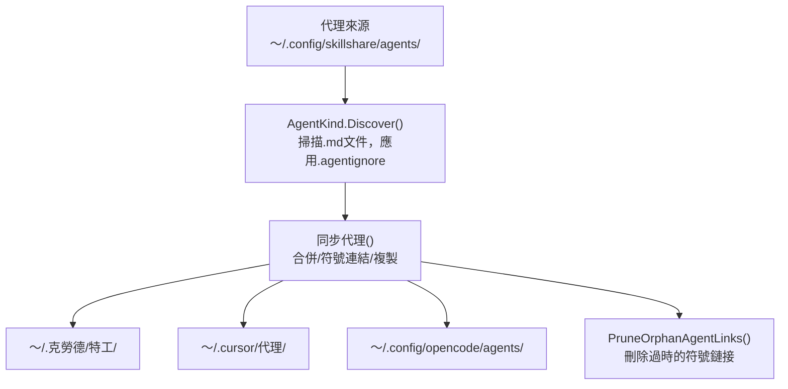

# Agents

> Source: https://skillshare.runkids.cc/docs/understand/agents

---

# 代理


單一文件`.md`資源與技能一起管理－相同的同步、審核和生命週期，不同的形狀。

這什麼時候重要？

一些 AI CLI（Claude Code、Cursor、OpenCode、Augment、Copilot CLI）區分 **技能**（帶有 `SKILL.md` 的目錄）和 **代理**（獨立 `.md` 檔案）。如果您的目標支援代理，skillshare 可以從單一事實來源管理兩者。


## 技能與特工


| |技能|代理人|
| --- | --- | --- |
|形狀|包含 SKILL.md + 可選檔案的目錄 |單一 .md 檔案 |
|名稱解析 | SKILL.md frontmatter 名稱欄位 |檔案名稱（例如，tutor.md =「tutor」），可選的 frontmatter 名稱覆蓋 |
|原始碼目錄 | 〜/.config/skillshare/skills/| ~/.config/skillshare/agents/（可透過agents_source自訂）|
|專案來源| .skillshare/技能/ | .skillshare/代理人/ |
|忽略文件 | .skillignore | .agentignore |
|同步裝置|目錄符號連結（合併）、整個目錄符號連結（符號連結）、目錄複製（複製）|檔案符號連結（合併）、整個目錄符號連結（符號連結）、檔案複製（複製） |
|嵌套支援 | path/to/skill 扁平化為 path__to__skill | dir/file.md 扁平化為 dir__file.md |
|追蹤 |支援 |支援 |
|審計|支援 |支援 |
|收藏|支援 |支援 |


---


## 目錄結構


### 全球


```
~/.config/skillshare/
├── skills/              # Skill source (directories)
│   ├── my-skill/
│   │   └── SKILL.md
│   └── .skillignore
├── agents/              # Agent source (files)
│   ├── tutor.md
│   ├── reviewer.md
│   └── .agentignore
└── config.yaml
```


### 項目


```
.skillshare/
├── skills/
│   └── api-conventions/
│       └── SKILL.md
├── agents/
│   ├── onboarding.md
│   └── .agentignore
└── config.yaml
```


### 自訂來源目錄


全域模式下，代理源預設為`~/.config/skillshare/agents/`。若要使用自訂位置，請在 `config.yaml` 中設定 `agents_source`：


```
agents_source: ~/my-agents
```


專案模式始終使用`.skillshare/agents/`，不支援`agents_source`。


詳情請參閱【設定-agents_source】(https://skillshare.runkids.cc/docs/reference/targets/configuration#agents-source)。


---


## 代理文件格式


代理程式是普通的 `.md` 檔案。 Frontmatter 是可選的：


```
---
name: math-tutor
description: Helps with math problems step by step
---
# Math Tutor
You are a patient math tutor. Walk through problems step by step.
```


**命名規則：**


- 檔案名稱決定代理名稱：`tutor.md` =“tutor”
- YAML frontmatter 中可選的 `name` 欄位會覆寫檔案名
- 檔案名稱必須以字母或數字開頭，僅包含`a-z`、`A-Z`、`0-9`、`_`、`-`、`.`
- 最大名稱長度：128 個字符


**常規排除** — 在發現過程中總是會跳過這些檔名：`README.md`、`CHANGELOG.md`、`LICENSE.md`、`HISTORY.md`、`SECURITY.md`、`SKILL.md`


---


## 支援的目標


只有具有 `agents` 路徑定義的目標才會接收代理同步。現在：


|目標|全球代理商之路|專案代理之路|
| --- | --- | --- |
|克勞德| ~/.claude/特工 | .claude/特工 |
|遊標| 〜/ .cursor /代理| .cursor/代理|
|開放代碼 | 〜/ .config / opencode /代理| .opencode/代理 |
|增強| 〜/ .augment /代理| .增強/代理|
|副駕駛 | ~/.copilot/特工 | .github/代理 |


沒有`agents`條目的目標（大多數）僅獲得技能。


---


## 同步行為


代理同步支援所有三種模式，與技能相同：


|模式|行為 |
| --- | --- |
|合併（預設）|每個檔案的符號連結。目標中的本地代理文件將被保留。 |
|符號連結 |整個代理目錄已符號連結。 |
|複製|代理文件複製為真實文件。 |


```
# Sync everything (skills + agents)
skillshare sync
# Sync agents only
skillshare sync agents
```


孤立清理的工作方式相同－損壞的符號連結或不再有源的複製檔案會被自動修剪。


---


## 收集行為


代理收集使用與技能收集相同的 CLI 合約，但在 `.md` 代理文件上運行：


```
# Global
skillshare collect agents claude
skillshare collect agents --all
skillshare collect agents claude --dry-run
skillshare collect agents claude --json
# Project
skillshare collect -p agents claude
skillshare collect -p agents --all
skillshare collect -p agents --json
```


規則：


- 預設會跳過現有的來源代理
- 使用`--force`覆蓋現有的來源代理
- `--json` 暗示`--force` 並跳過確認提示
- 網路儀表板收集頁面仍僅限技能；使用 CLI 代理


---


## `.agentignore`


與 `.skillignore` 的工作方式相同 — gitignore 風格的模式，用於從同步中排除代理。


|範圍 |路徑|
| --- | --- |
|全球| 〜/.config/skillshare/agents/.agentignore |
|項目| .skillshare/agents/.agentignore | .skillshare/agents/.agentignore


例子：


```
# Disable draft agents
draft-*
# Disable a specific agent
experimental-reviewer
```


使用 `enable`/`disable` 和 `--kind agent` 來管理條目：


```
skillshare disable --kind agent draft-reviewer
skillshare enable --kind agent draft-reviewer
```


---


## 從儲存庫安裝代理


安裝儲存庫時，skillshare 會自動偵測代理程式：


1. 在儲存庫中尋找`agents/`約定目錄 - 裡面的`.md`檔案（不包括常規排除）是候選代理
2. 如果repo同時有`skills/`和`agents/`，則兩者都安裝
3. 若倉庫只有`agents/`（沒有`SKILL.md`標記），則安裝代理
4. 如果儲存庫沒有 `skills/`，沒有 `agents/` 目錄，但根目錄下有鬆散的 `.md` 檔案 — 被視為代理（純代理程式儲存庫）


### 明確標誌


```
# Install only agents from a repo
skillshare install github.com/user/repo --kind agent
# Install specific agents by name (-a shorthand)
skillshare install github.com/user/repo -a tutor,reviewer
# Install specific skills by name (unchanged)
skillshare install github.com/user/repo -s my-skill
```


---


## CLI 指令


大多數指令接受 `agents` 位置參數或 `--kind agent` 標誌來作用於代理：


|指令|範例|它有什麼作用 |
| --- | --- | --- |
|代理列表 |技能分享列表代理|來源 | 列出代理
|檢查代理|技能共享檢查代理|檢查代理完整性並更新狀態 |
|審計代理| Skillshare 審計代理 |安全掃描代理|
|同步代理程式 | Skillshare 同步代理程式 |僅將代理程式同步到目標 |
|徵集代理人| Skillshare 收集代理 克勞德 |收集本地目標代理回源|
|更新代理程式| Skillshare 更新代理程式 --全部 |更新追蹤的代理程式儲存庫和元資料支援的代理程式 |
|啟用--kind代理| Skillshare Enable--親切的代理導師|重新啟用已停用的代理 |
|禁用 --kind 代理 | Skillshare禁用--kind代理導師|透過 .agentignore 禁用代理 |
|安裝 --kind 代理程式 | Skillshare install repo --kind 代理程式 |僅安裝來自儲存庫的代理程式 |
|安裝-a | Skillshare install repo -a 導師 |依名稱安裝特定代理程式 |


如果沒有種類過濾器，指令將同時作用於技能和代理。


---


## 資料流





---


## 專案模式


代理在專案模式下的工作方式與技能相同：


```
# Initialize project (creates .skillshare/agents/ alongside .skillshare/skills/)
skillshare init -p
# Install agents into project
skillshare install github.com/user/repo --kind agent -p
# Update project agents in place
skillshare update agents --all -p
# Sync project agents
skillshare sync -p
```


專案代理來源：`.skillshare/agents/`已安裝的代理程式（追蹤）記錄在`.metadata.json`中，並建立​​`.gitignore`條目，與追蹤的技能相同。